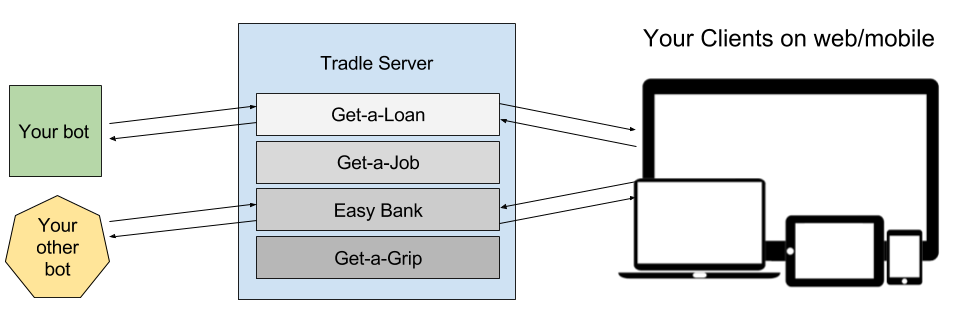
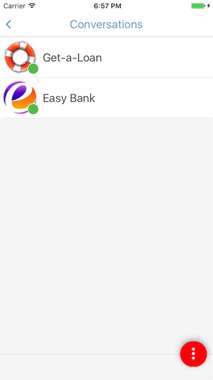

# @tradle/bots

<!-- START doctoc generated TOC please keep comment here to allow auto update -->
<!-- DON'T EDIT THIS SECTION, INSTEAD RE-RUN doctoc TO UPDATE -->


- [What the bot is this?](#what-the-bot-is-this)
- [Your bot, the Tradle server, and the clients](#your-bot-the-tradle-server-and-the-clients)
- [Prerequisites](#prerequisites)
  - [Platform](#platform)
  - [Environment](#environment)
    - [OSX Users](#osx-users)
  - [Tradle server docker image](#tradle-server-docker-image)
- [Usage](#usage)
  - [Clone this repository](#clone-this-repository)
  - [Install dependencies](#install-dependencies)
    - [with npm](#with-npm)
    - [with yarn](#with-yarn)
  - [Run Tradle server](#run-tradle-server)
  - [Create a provider](#create-a-provider)
  - [Connect your Tradle app](#connect-your-tradle-app)
  - [Peek at the config](#peek-at-the-config)
  - [Console](#console)
    - [Sample Session](#sample-session)
    - [Console globals](#console-globals)
  - [Strategies](#strategies)
    - [Receiving messages](#receiving-messages)
    - [Sending messages](#sending-messages)
    - [Creating blockchain seals](#creating-blockchain-seals)
    - [Events](#events)
  - [Managing users](#managing-users)
- [Known Limitations](#known-limitations)
- [Contributing](#contributing)

<!-- END doctoc generated TOC please keep comment here to allow auto update -->

## What the bot is this?

This is a bot framework and a set of sample bots, referred to as "strategies" from here on for interfacing with a [provider](#your-bot-the-tradle-server-and-the-clients) running on a Tradle server

The Tradle server takes care of:
- running the Tradle engine
  - secure line to your users
  - creation/monitoring of blockchain transactions
- calling your bot's web server with messages from the user (and blockchain-related events)

The Tradle app takes care of:
- cross-platform support (iOS & Android). iOS is currently more mature.
- cross-browser support (Chrome, Firefox, Safari, IE11). Chrome currently has the best support.
- UI (you can do some per-provider theming on the server-side)

This framework supports:
- asynchronous messaging
- reliable persistent-queue-based send/receive on both the server and the bot ends
- easy to get started, see below sample strategy

## Your bot, the Tradle server, and the clients



The Tradle server acts like a router between your bot and your clients, on their Tradle apps. Your bot will represent a single provider, as different providers typically require different functionality. Being able to set up multiple service providers on one Tradle server makes it easier to test and do demos.

From the client's perspective (see the Tradle app screenshot below), providers are listed together in the Conversations screen.

In the guide that follows, you'll set up a service provider called Get-a-Loan, and connect your bot to it.



## Prerequisites

How can you have any pudding if you don't eat your prerequisites?

### Platform

These instructions have been tested on the following platforms:
- macOS Sierra

If you run into problems setting up, submit an issue!

### Environment

You will be using a dockerized Tradle server, and building your bots with Node.js

- [Docker](https://docs.docker.com/engine/installation/).
- [Docker Compose](https://docs.docker.com/compose/install/)
- [Node.js](https://nodejs.org/en/) 6 or later

#### OSX Users

1. Docker used to run via boot2docker, but now has the much better [Docker for Mac](https://docs.docker.com/docker-for-mac/). Install it. 
2. Remove environment variables in your `~/.bash_profile` that start with `DOCKER_`. These are boot2docker's legacy.
3. Open a fresh shell. Mm, you smell that? Me neither. boot2docker will plague us no more.

### Tradle server docker image 

1. Create an account on Docker Hub 
2. Run `docker login` in your shell and login with your Docker Hub credentials

## Usage

### Clone this repository

```sh
git clone https://github.com/tradle/bots tradle-bots
cd tradle-bots
```

### Install dependencies

#### with npm

Run `npm install`

#### with yarn

[yarn](https://github.com/yarnpkg/yarn) is the faster, leaner, and more emoji-infused package manager on the block.

To install it, smirk ironically, and run: 

```sh
npm i -g yarn
# if that doesn't work: sudo npm i -g yarn
```

Then install dependencies by running `yarn`

### Run Tradle server

This uses the Docker Compose file [tradle-server-compose.yml](./tradle-server-compose.yml), at the root of your `tradle-bots` folder:

On OSX, to enable connecting from the container to the host, run:

```sh
# https://docs.docker.com/docker-for-mac/networking/#/known-limitations-use-cases-and-workarounds
#   see: "I want to connect from a container to a service on the host"
sudo ifconfig lo0 alias 10.200.10.1/24
```

Create the necessary volumes, and launch!

```sh
# switch to your tradle-bots directory
# 
# each of these lines should take a few seconds tops
# if the console seems to hang, your docker daemon is unreachable
docker volume create --name server-conf
docker volume create --name server-storage
# start up dockerized tradle server
docker-compose -f tradle-server-compose.yml up -d
```

### Create a provider

Let's create a provider called Get-a-Loan, with handle `loans` (url path: `/loans`), and one mortgage product.

```sh
# attach to the tradle-server container
docker attach tradle-server
# ( you may need to hit Enter an extra time to show the prompt )
# you are now in the tradle server's command line client
# let's create a provider
tradle-server$ newprovider loans "Get-a-Loan"
# Generating a really good provider: loans 
# This may take a few seconds...
# Enter a local path or a url of the provider logo:
http://www.myiconfinder.com/uploads/iconsets/128-128-767de7a98f30bb81036e1829a50cfd06-float.png
# disable the Tradle server's in-house bot, which has its own complex agenda
tradle-server$ silent loans
# subscribe your bot's web server for webhooks
# OSX: see the previous section for the explanation for the IP address value
tradle-server$ newwebhook loans http://10.200.10.1:8000
# if you want to play with the products strategy (./lib/strategy/products.js)
# uncomment the next line:
# tradle-server$ enableproduct loans tradle.MortgageProduct
# start things up
tradle-server$ restartproviders
```

Note: when attached to a Docker container, if you hit Ctrl+C, you will kill it. Docker Compose will automatically restart it (see the `restart: always` flag in [tradle-server-compose.yml](./tradle-server-compose.yml)), but to be nice, detach with `Ctrl+P Ctrl+Q`

### Connect your Tradle app

1. If you're using the Tradle mobile app, make sure your phone is on the same network as the computer running your Tradle server.
2. Get your computer's local ip.
3. In your Tradle app, on the Conversations screen, click the red button, and choose Add Server URL. Enter the address of your Tradle server: `http://{your_local_ip}:44444`

### Peek at the config

As you can see in [sample-conf.json](./sample-conf.json), the sample implementations will look for a provider at `http://localhost:44444/loans`, where `http://localhost:44444` is your Tradle server url, and `loans` is the handle of the provider you just created [above](#run-tradle-server).

### Console

The easiest way to get started is by playing in the Javascript console. Make sure your Tradle server us up and [running](#run-tradle-server). 

The console can be started by running `npm start`. Below is a sample session. Below that, see an outline of the objects and functions available in the global scope.

#### Sample Session

```sh
# switch to your tradle-bots directory
#
# npm start runs ./cmd.js with lots of logging. See "scripts" in package.json
$ npm start
# Listening on port 8000
# 
# before anything test the connection to your provider:
health()
testing connection to provider...
all good!
# list stored users
bot.users.list()
# no users yet
{}
# list our strategies
bot.strategies.list()
# we're using the silly strategy (see './lib/strategy/silly.js')
# depending on your config (sample-conf.json), you may be using a different one
[ [Function: sillyStrategy] ]
# screw that for now, we want to talk to our users manually
bot.strategies.clear()
bot.strategies.list()
[]
# print to console all received message
togglePrintReceived()
# go to your Tradle app and say something to the provider your bot's hooked up to
# ..yay, we got a message
#  a7d454a8ec9a1bd375f9dd16afdadff9ed8765a03016f6abf7dd10df0f7c8fbe {
#  "_s": "CkkKBHAyNTYSQQQkBY3Zz1lTCpyGK4aQzW8mzp8cz7KuvP0U9Km8vddXuL8PFnHpeFN60seFpmvGTAmy0hpA4hg/zQVsYXc2h8kIEkcwRQIgdQy4DkLs3AcYZ+LsbZvEyGNbuLzuyNHri1kWuvN3Su8CIQC6TwkhBqyJn+QG5gUFFFmnxZS+iI0OJ2yQIB4I2dGhbA==",
#  "_t": "tradle.CustomerWaiting",
#  "_z": "ac1c730a4b803b9cb9ca88c6ed0ddadce06d89e5f881f4c91f76e64050728a4c",
#  "message": "Ove has entered the chat",
#  "time": 1486070892140
}
# list stored users
bot.users.list()
# ok, this is that person that was messaging us earlier
# { a7d454a8ec9a1bd375f9dd16afdadff9ed8765a03016f6abf7dd10df0f7c8fbe: 
#   { id: 'a7d454a8ec9a1bd375f9dd16afdadff9ed8765a03016f6abf7dd10df0f7c8fbe',
#     history: [ [Object], [Object], [Object], [Object], [Object], [Object] ],
#     forms: {},
#     applications: {},
#     products: {},
#     importedVerifications: [],
#     profile: { firstName: 'Ove' } } }
# ok, this is the guy who was messaging us earlier
# let's say hi
bot.send({ userId: 'a7d454a8ec9a1bd375f9dd16afdadff9ed8765a03016f6abf7dd10df0f7c8fbe', object: 'hey Ove!' })
# ok, good chat, let's turn the products strategy back on
bot.strategies.use(strategies.products)
```

#### Console globals

as you can see in the session above, the console exposes a bunch of objects and functions in the global scope:

```
- health                      [Function]    test the connection to your provider
- togglePrintReceived         [Function]    toggle the printing to console of received messages
- bot                         [Object]
  - bot.strategies            [Object]
    - bot.strategies.list     [Function]    list enabled strategies
    - bot.strategies.use      [Function]    enable a strategy
    - bot.strategies.disable  [Function]    disable a strategy
    - bot.strategies.clear    [Function]    disable all strategies
  - bot.users                 [Object]
    - bot.users.list          [Function]    list users
    - bot.users.get           [Function]    get a user's state by id
    - bot.users.del           [Function]    delete a user
    - bot.users.clear         [Function]    delete all users
    - bot.users.new           [Function]    create a new user (you probably don't need this)
  - bot.seals                 [Object]
    - bot.seals.list          [Function]    list seals
    - bot.seals.get           [Function]    get a seal by an object link
    - bot.seals.queued        [Function]    get queued seals
  - bot.queued                [Object]
    - bot.queued.seals        [Function]    list queued seals (same as bot.seals.queued())
    - bot.queued.send         [Function]    list queued sends
    - bot.queued.receive      [Function]    list queued receives
  - bot.send                  [Function]    send a message to a user
```

### Strategies

Yadda yadda, the examples were fun, now how do I build my own bot?

Implementing a basic strategy for a bot is easy. See [./lib/strategy](./lib/strategy) for examples. Below is the echo strategy, which echoes everything any given user says back to them (and boy, do users love it).

```js
// ./lib/strategy/echo.js
const { co } = require('bluebird').coroutine

module.exports = function echoStrategy (bot) {
  return bot.addReceiveHandler(co(function* ({ user, object, link /*, other goodies*/ }) {
    // we received `object`
    // send it back
    yield bot.send({ userId: user.id, object })
  }))
}
```

If your Promises are a bit rusty, or if you're asking yourself "what's `co`?" or "isn't `yield` only for generators?", skim [this](./docs/promises.md)

[./lib/strategy/silly.js](./lib/strategy/silly.js) is a slightly more complex strategy, and [./lib/strategy/products.js](./lib/strategy/products.js) is an expert-system type strategy that is a pared down version of the Tradle server's in-house bot's strategy.

#### Receiving messages

To handle incoming messages from users, add a receive handler as follows:

```js
function myStrategy (bot) {
  bot.addReceiveHandler(function ({ user, object, link /*, other goodies*/ }) {
    // return a Promise to ensure receive order
  })

  // tip: wrap in `co` to make your async javascript saner:
  // 
  // const co = require('bluebird').coroutine
  // bot.addReceiveHandler(co(function* ({ user, object /*, other goodies*/ }) {
  //   yield promiseSomething()
  //   yield promiseSomethingElse()
  // }))
}
```

#### Sending messages

To send a message to a user, use `bot.send({ userId, object })`:

```js

function myStrategy (bot) {
  // const news = ...
  // ...
  news.on('raining men', function () {
    // bot.send(...) returns a Promise. Sensing a theme?
    bot.send({ 
      userId: String, 
      object: {
        _t: 'tradle.SimpleMessage'
        message: 'wear a helmet'
      }
      // equivalent shorthand for sending simple messages:
      // object: 'wear a helmet'
    })
  })
  // ...
}
```

#### Creating blockchain seals

Objects sent to a user, or received from a user can be sealed on blockchain as follows. To seal an object, you need to know its `link`, which 

```js
function echoAndSealStrategy (bot) {
  return bot.addReceiveHandler(co(function* ({ user, object, link /*, other goodies*/ }) {
    yield bot.send({ userId: user.id, object })
    yield bot.seal({ link })
  }))
}
```

#### Events

the `bot.users` object emits the following events:

- 'create': a new user state object has been created
- 'delete': a user state object has been deleted
- 'clear': all user state has been deleted
- 'update': a user state object has changed

the `bot.seals` object emits the following events:

- 'push': a request to seal an object has been pushed to the Tradle server
- 'wrote': the Tradle server has written a seal to the blockchain
- 'read': the Tradle server has read a seal for an object from the blockchain

the `bot` object emits the following events:

- 'message': when a message has been handled by all enabled strategies without error
- 'sent': when a message has been sent to the Tradle server for deliver to the client
- 'seal:push', 'seal:wrote', 'seal:read': re-emitted for convenience from `bot.seals`
- 'user:create', 'user:delete', 'user:clear', 'user:update': re-emitted for convenience from `bot.users`

### Managing users

`bot.users` is the user manager object, which you can explore in the [console](#console). If you like mostly empty JSON objects, you're going to love this one.

Each user has a single state object, which is accessible with `bot.users.get(userId)`

Users are automatically registered with a default state object when the first message from them is received:

```json
{
  "id": "..userId..", 
  "history": [] 
}
```

When you `bot.send(...)` or when your bot receives messages, they get appended to `state.history`. You can store whatever your evil bot needs on the user state object, just don't forget to `bot.users.save(userState)` lest the evil be thwarted.

## Known Limitations

- database: for simplicity and ease of getting started, the bot framework uses [lowdb](https://github.com/typicode/lowdb) for its databases. Yes, it's not a production-level database, it writes synchronously to the file-system, etc. Feel free to substitute it with your personal preference once you're past the prototype phase (e.g. the Tradle server uses LevelDB).

## Contributing

Pull requests are welcome. If you build a strategy that you would like to share or show off, submit a pull request to add it to this README.
